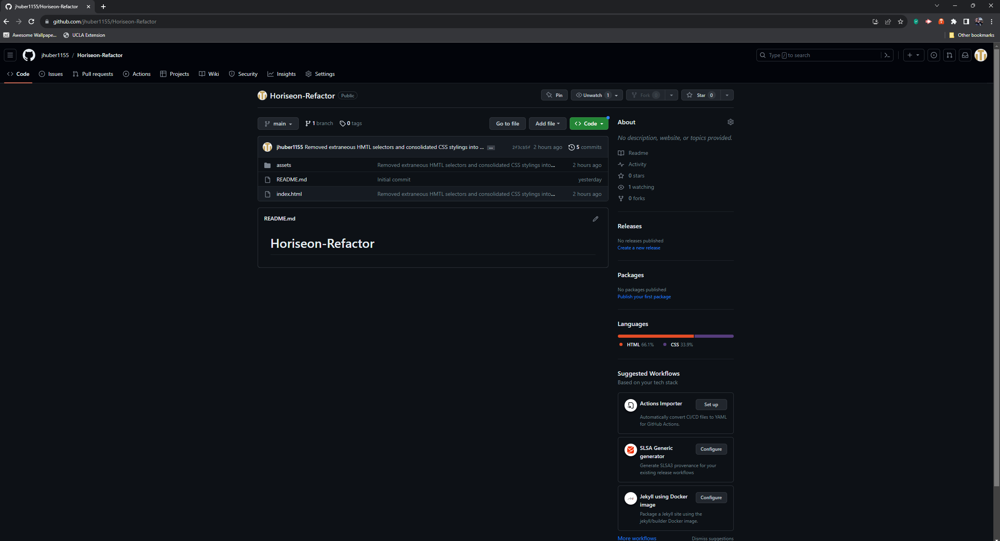
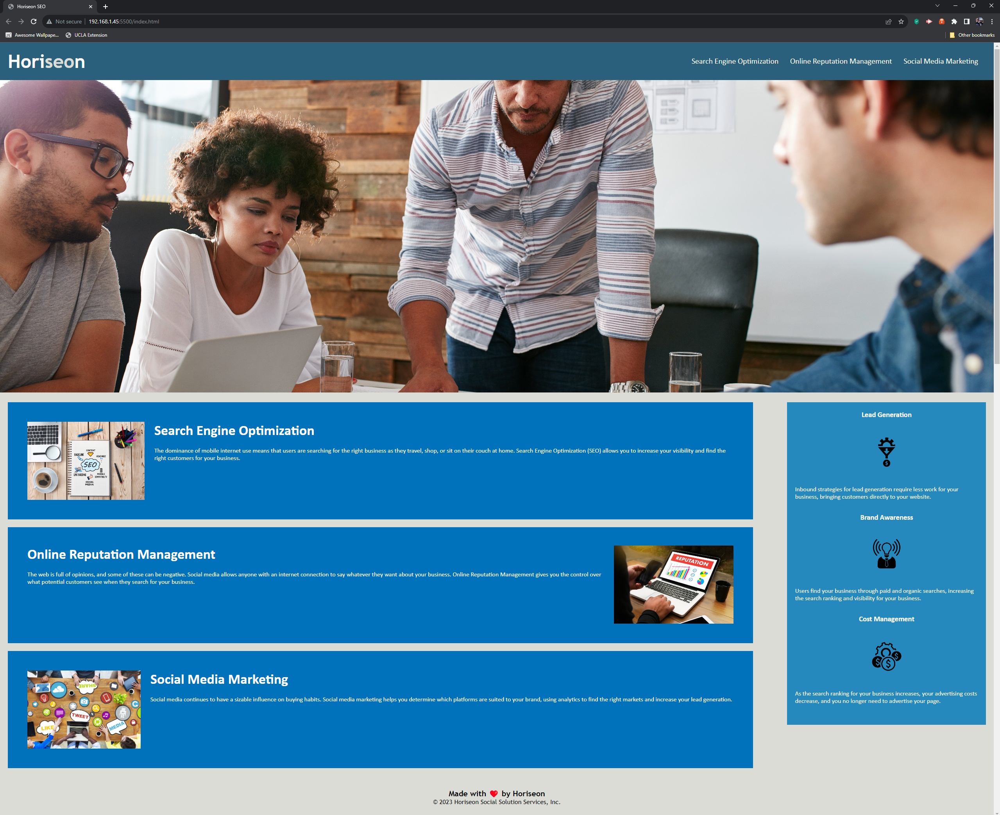

# Horiseon-Refactor

## Client Webpage Accessibility

This refactor was created to allow for faster load times as well as more traffic and engagement with users who have trouble accessing the site in the traditional manner. Particular care and attention was given to create a more streamline and expressive environment for those users who browse the web with alternative methods and applications. ***This refactor allows the client (Horiseon) to load their webpage more efficently and engage with a wider audience, allowing them offer their services to a larger population, giving them an edge over their competitors and allowing for more prospective revenue.***

While refactoring this code the lessons learned, but not limited to, included:

1. Understanding how Hypertext Mark Up Language (HTML) and Cascading Style Sheets (CSS) interact and influence one another to generate a more graphic and richer user experience.

1. Allowing coders to take into account factors such as accessibility issues when designing and coding websites. Intentional thought and care with this accessibility in mind will allow for a wider variety of users to experience the website.

1. Developing an eye for repeating elements and styles which allows coders in turn to understand how to consolidate those repeating aspects into a more efficent manner, leading to faster load times and potentially more user engagement. This development also reinforces the industry mantra of 'Do Not Repeat Yourself' (DRY).

1. Using semantic elements over non-descriptive generic elements helps break the website into an explanatory experience and allow for more managable sections. This labeling and chunking allow for quick and easy debugging and referencing when comparing CSS styles and the corresponding HTML code which it enhances.

1. Using descriptor tags on elements like images help develop a richer user experience for those people who do not view images or website in the traditional manner. A description of an image helps paint a more detailed picture of what the website, and in turn, the client, can do for the end user.

## Deployment and Usage
To deploy the mock-up of this site with the revised code please do the following:

1. Go to [Github Pages](www.github.com/jhuber1155/Horiseon-Refactor)

1. Click the green 'Code' button

1. Clone the repository using HTTPS or an established SSH key into your preferred folder destination.

1. Run the Git Bash terminal (or its equivalent) and using git commands, enter the repository Horiseon-Refactor.

1. Run the git command `code .`

1. Open the index.html with the Live Server Extension in VSCode (or its equivalent in other code editor environments).

## Credits
This project was made possible with the help from the Instructors and fellow students of the UCLA Coding Bootcamp. Other helpful sources include references from [W3Schools Online Web Tutorials](https://www.w3schools.com/) and [MDN Web Docs](https://developer.mozilla.org/en-US/).

## License

MIT License

Copyright (c) [2023] [John Huber]

Permission is hereby granted, free of charge, to any person obtaining a copy
of this software and associated documentation files (the "Software"), to deal
in the Software without restriction, including without limitation the rights
to use, copy, modify, merge, publish, distribute, sublicense, and/or sell
copies of the Software, and to permit persons to whom the Software is
furnished to do so, subject to the following conditions:

The above copyright notice and this permission notice shall be included in all
copies or substantial portions of the Software.

THE SOFTWARE IS PROVIDED "AS IS", WITHOUT WARRANTY OF ANY KIND, EXPRESS OR
IMPLIED, INCLUDING BUT NOT LIMITED TO THE WARRANTIES OF MERCHANTABILITY,
FITNESS FOR A PARTICULAR PURPOSE AND NONINFRINGEMENT. IN NO EVENT SHALL THE
AUTHORS OR COPYRIGHT HOLDERS BE LIABLE FOR ANY CLAIM, DAMAGES OR OTHER
LIABILITY, WHETHER IN AN ACTION OF CONTRACT, TORT OR OTHERWISE, ARISING FROM,
OUT OF OR IN CONNECTION WITH THE SOFTWARE OR THE USE OR OTHER DEALINGS IN THE
SOFTWARE.